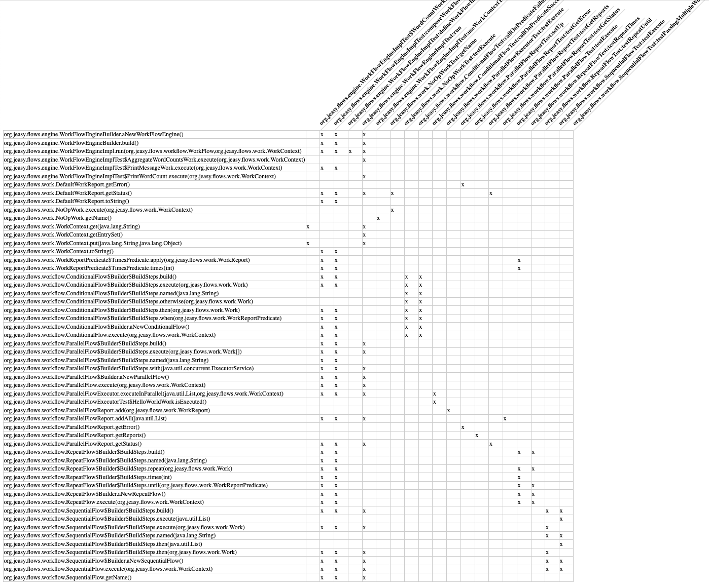

# Matrixer

A tool for creating binary test coverage matrices of java code.

{width=100}

## Usage

### Dependencies
- Gradle
- JDK >11

### Build and run
1. Clone the repo to a local directory and open it.
2. Assemble the tool and the agent using `gradlew assemble` or `gradlew build`.
   The latter will run the tests in the process.
3. Run the tool using `gradlew run --args "<options>"`, see below for available
   `<options>`.

### Synopsis

    Usage:
        matrixer --target <path> --pkg <target package name> [--testpkg <test package name>] [--output <path>] [--git <URL>]

        --target  - the location of an existing project or the path to clone the remote repo to
        --pkg     - root package name of the target project, will be used to identify target methods
        --testpkg - root package name of the tests, will be used to identify test cases (defaults to --pkg)
        --output  - the location where logs and results will be stored. Defaults to build/matrix-cov for gradle and target/matrix-cov for maven
        --git     - if the project is remote, provide a URL to the repository

